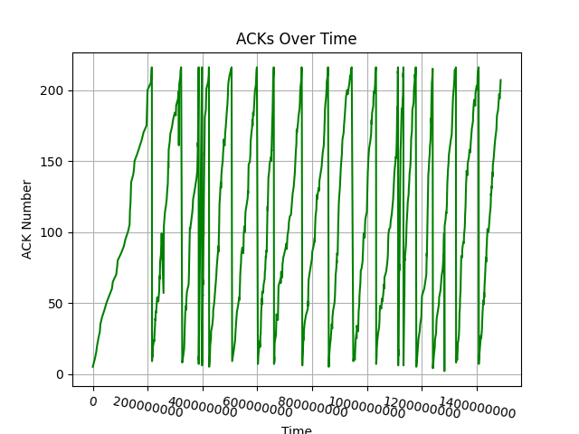

# TCP Client-Server Packet Simulation

This project simulates a TCP-like client-server architecture to study packet transmission, loss, retransmission, and goodput. It's designed for educational benchmarking and analysis as part of the CS 258 Computer Communication Systems coursework.

---

## 📁 Project Structure

```bash
├── client.py                # Client script that sends packets with simulated loss and retransmissions
├── server.py                # Server script that receives packets and computes ACKs & goodput
├── visualization.py         # Visualization script to plot client/server behavior from logs
├── *.csv                    # Generated logs (client/server)
├── *.png                    # Visualization output (optional)
```

---

## ⚙️ Setup

### Requirements
- Python 3.8+
- Recommended: virtual environment

### Install dependencies
```bash
pip install -r requirements.txt
```
(*You may create a `requirements.txt` with pandas and matplotlib*)

---

## 🚀 How to Run

### 🖥️ Server
```bash
python server.py --log
```
This will:
- Start the server on `0.0.0.0:12345`
- Enable CSV logging of received packets, ACKs, and goodput

### 📡 Client
```bash
python client.py --log
```
This will:
- Simulate packet transmission up to 10,000 packets
- Introduce random packet loss
- Perform retransmissions with exponential backoff
- Export logs every 100 packets

---

## 📊 Visualization

After running a full session with `--log`, use:
```bash
python visualization.py
```
This will generate 3 graphs:
- `client_packet_events.png`: Packet drops (red) and retransmissions (orange)
- `server_ack_progress.png`: ACKs received over time
- `server_goodput.png`: Goodput variation over time (sliding window)

These files will be saved in the current directory.

---

## 📌 Notable Features

- Custom ANSI color-coded logs for real-time analysis
- Artificial delays for demo visibility (optional toggle)
- Supports multiple client connections
- Sliding window goodput metric every 40 packets
- Clean CSV export for reproducible analysis

---

## 📷 Sample Outputs

### Drops & Retransmissions


### ACK Timeline



### Goodput Variation


---
